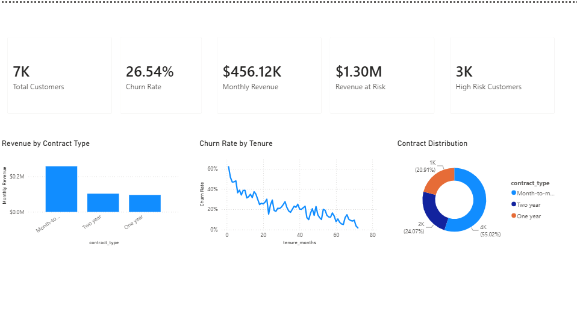
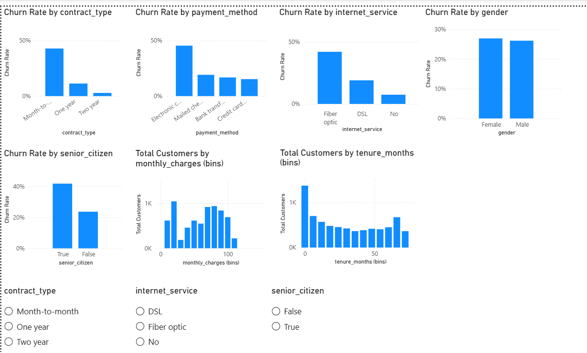
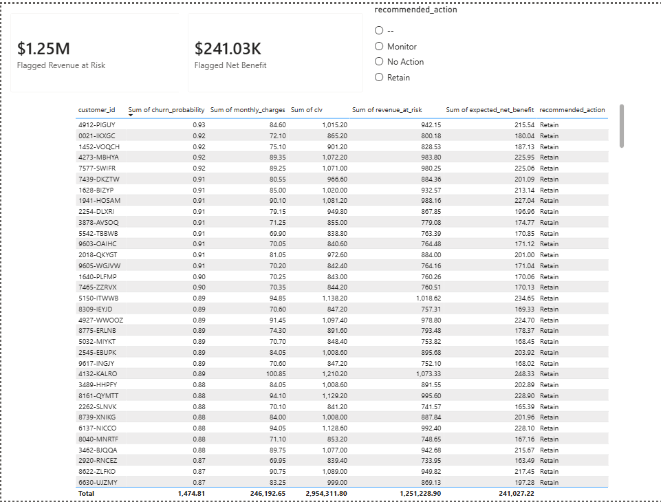

# Churn-Retention-Engine

**Customer Churn Analytics Platform with Business-Driven Retention Strategy**

## Overview

A telecom company is losing customers every month. This project builds an end-to-end analytics platform to answer:

- Which customers are likely to churn?
- Why are they leaving?
- How much revenue is at risk?
- Which customers should receive a retention offer — and is that better than targeting people at random?

Rather than stopping at a trained model, this project includes a **Business Decision Engine** that converts churn predictions into a per-customer recommendation (Retain / Monitor / No Action), based on estimated customer lifetime value, retention offer cost, and expected net benefit — with the model's classification threshold chosen to maximize business ROI, not left at a default 0.5.

## Architecture

```text
IBM Telco Dataset
        │
        ▼
PostgreSQL Database
        │
        ▼
Data Validation & Cleaning
        │
        ▼
SQL Business Analytics
        │
        ▼
Exploratory Data Analysis
        │
        ▼
Feature Engineering
        │
        ▼
Machine Learning Models
        │
        ▼
Business Decision Engine
        │
        ▼
Power BI Dashboard
```

## Tech Stack

| Layer | Technology |
|---|---|
| Database | PostgreSQL (Docker) |
| Query Language | SQL |
| Programming | Python (Pandas, NumPy) |
| Machine Learning | Scikit-learn, XGBoost |
| Visualization | Power BI |
| Version Control | Git & GitHub |

## Dataset

[IBM Telco Customer Churn Dataset](https://www.kaggle.com/datasets/blastchar/telco-customer-churn) — 7,043 customers, 21 features, binary churn label.

## Repository Structure

```text
Churn-Retention-Engine/
│
├── data/
│   ├── raw/                       # Original CSV (committed — small, public)
│   └── processed/                 # Cleaned + feature-engineered outputs (gitignored, regenerable)
│
├── database/
│   ├── schema.sql                 # customers table definition
│   ├── analysis_queries.sql       # FR-3 business SQL, by category
│   └── dashboard_view.sql         # customer_dashboard view for Power BI
│
├── notebooks/
│   └── EDA.ipynb
│
├── src/
│   ├── db.py                      # shared env-based Postgres connection helper
│   ├── load_data.py               # FR-1 — CSV → PostgreSQL
│   ├── validation.py              # FR-2 — data quality checks
│   ├── preprocessing.py           # FR-2 — cleaning logic
│   ├── feature_engineering.py     # FR-5 — engineered features
│   ├── train_model.py             # FR-6 — model training
│   ├── evaluate_model.py          # FR-6 — metrics, comparison
│   └── retention_strategy.py      # FR-7 — CLV, threshold, recommendations
│
├── models/                        # saved .pkl files (gitignored, see models/README.md)
├── dashboard/
│   └── Customer_Churn.pbix
├── reports/
│   ├── phase3_findings.md         # actual SQL query output numbers
│   ├── model_comparison.md        # model metrics + ROI threshold addendum
│   ├── top_risk_customers.md      # sample of scored high-risk customers
│   └── screenshots/
│
├── README.md
├── requirements.txt
└── .gitignore
```

## Setup

```bash
# Clone the repo
git clone https://github.com/Lavannya22/Churn-Retention-Engine.git
cd Churn-Retention-Engine

# Create and activate a virtual environment
python -m venv venv
source venv/bin/activate   # Windows: venv\Scripts\activate

# Install dependencies
pip install -r requirements.txt

# Configure your local database connection
cp .env.example .env        # then fill in your PostgreSQL credentials

# Start PostgreSQL (this project was developed against a Docker container)
docker run --name churn-retention-db \
  -e POSTGRES_USER=<user> -e POSTGRES_PASSWORD=<password> -e POSTGRES_DB=<database> \
  -p 5432:5432 -v churn_retention_pgdata:/var/lib/postgresql/data \
  -d postgres:16

# Set up the schema
docker exec -i churn-retention-db psql -U <user> -d <database> < database/schema.sql

# Run the pipeline
python src/load_data.py
python src/validation.py
python src/preprocessing.py
python src/feature_engineering.py
python src/train_model.py
python src/evaluate_model.py
python src/retention_strategy.py

# Create the view Power BI connects to (after retention_strategy.py has run at least once)
docker exec -i churn-retention-db psql -U <user> -d <database> < database/dashboard_view.sql
```

Then open `dashboard/Customer_Churn.pbix` in Power BI Desktop, or connect it fresh to the `customer_dashboard` Postgres view (`localhost:5432`).

**Windows note:** Windows 11's Smart App Control can block scikit-learn/XGBoost's compiled extensions from loading (surfaces as a DLL load error, not a normal Python exception). If you hit this, run `train_model.py`, `evaluate_model.py`, and `retention_strategy.py` inside WSL2 instead of native Windows Python — everything else in the pipeline is unaffected. See Assumptions & Limitations below.

## Key Business Insights

Pulled from Phase 3's SQL analytics (`reports/phase3_findings.md`) and confirmed independently in Phase 4's EDA (`notebooks/EDA.ipynb`):

1. **The single riskiest segment is stark and specific:** customers on a **month-to-month contract paying by electronic check churn at 53.73%** (n=1,850), compared to just **5.74%** for customers on an **annual (1- or 2-year) contract paying by autopay** (n=1,934) — a **~9.4x difference** between the two segments. Contract type and payment method aren't independent risk factors here; together they identify the highest- and lowest-risk customer profiles in the entire dataset.

2. **Churn risk is heavily front-loaded into the first year.** Customers in their first 12 months churn at **47.44%**, dropping to 28.71% (months 13–24), 20.39% (months 25–48), and just **9.51%** for customers with 49+ months of tenure. Whatever is driving churn, it overwhelmingly happens early — retention effort aimed at brand-new customers has the most ground to cover.

3. **Support/security add-ons roughly halve churn for customers who have internet service at all**, and this isn't a minor effect: `online_security` (41.77% churn without it vs. 14.61% with it) and `tech_support` (41.64% vs. 15.17%) show the largest swings, with `online_backup` and `device_protection` close behind (~39% vs. ~22%). Notably, **Fiber optic customers churn at 41.89%** — more than double DSL's 18.96% — despite paying the most on average ($91.50/mo vs. $58.10/mo), suggesting fiber customers aren't purchasing the add-ons that would otherwise reduce their risk.

## Model Performance

Three models were trained and tuned (stratified 80/20 split, class-weighted / `scale_pos_weight`-adjusted for the ~26/74 churn imbalance, `RandomizedSearchCV` with 5-fold stratified CV scored on ROC-AUC). Evaluated on the held-out test set (1,409 customers) at the default 0.5 threshold:

| Model | Accuracy | Precision | Recall | F1 | ROC-AUC |
|---|---|---|---|---|---|
| Logistic Regression | 0.7339 | 0.4991 | 0.7834 | 0.6098 | 0.8437 |
| Random Forest | 0.7339 | 0.4992 | 0.7914 | 0.6122 | 0.8433 |
| **XGBoost** | **0.7417** | **0.5085** | **0.7995** | **0.6216** | **0.8459** |

**XGBoost was selected** — it wins on every metric simultaneously, not just ROC-AUC by a hair. When one model dominates across accuracy, precision, recall, *and* F1 at once, there's no interpretability-for-accuracy tradeoff worth making toward Logistic Regression.

**The default 0.5 threshold isn't what's actually used.** Phase 6 swept 91 candidate thresholds (0.05–0.95) against the held-out test set, scoring each by actual backtested dollar value — not F1, not accuracy — using the CLV/cost/success-rate assumptions below. The result: **the ROI-optimal threshold is 0.09**, far below 0.5.

| Threshold | Precision | Recall | Confusion Matrix |
|---|---|---|---|
| 0.09 (chosen) | 0.3379 | 0.9893 | TN=310, FP=725, FN=4, TP=370 |

**Why 0.09, not 0.5:** a wasted $20 retention offer (false positive) is cheap; a missed churner (false negative) costs their entire CLV — often $800–1,400. That cost asymmetry means it's worth flagging aggressively and accepting a lot of false positives to drive false negatives down to nearly zero (only 4 missed, out of 374 actual churners in the test set). Optimizing for F1 or accuracy would never surface this threshold, because those metrics treat a $20 mistake and an $800+ mistake as equally bad.

## Business Decision Engine

For every currently-active (not yet churned) customer, `retention_strategy.py` computes:

- **CLV** = `monthly_charges × 12` — a flat 12-month horizon. Deliberately simple: it doesn't account for discounting or churn-adjusted expected tenure. Documented as a limitation, not an oversight — the point of this project is the decision framework, not a perfectly calibrated CLV model.
- **Revenue at risk** = `churn_probability × CLV`
- **Expected net benefit** = `churn_probability × 25% offer success rate × CLV − $20 offer cost`
- **Recommended action**: `Retain` if `churn_probability` clears the ROI-optimal threshold (0.09) *and* expected net benefit is positive; `Monitor` if high-risk but not economically worth an offer; otherwise `No Action`.

**Assumptions** (see also Assumptions & Limitations): retention offer costs **$20/customer**, and succeeds **25%** of the time it's offered.

**Backtested business value on the held-out test set:**

| Scenario | Business value |
|---|---|
| No retention program at all | -$327,684.60 |
| Default 0.5 threshold | -$6,246.60 (barely better than nothing) |
| **ROI-optimal threshold (0.09)** | **+$57,091.65** |

The default threshold would have left the retention program a net loss. The ROI-tuned threshold flips it to a net gain — that's the core thesis of this project in one number.

**Recommendations across all 5,174 currently-active customers:** 3,128 Retain, 461 Monitor, 1,585 No Action.

**Sample — top 5 highest-risk customers** (full top-20 in `reports/top_risk_customers.md`):

| customer_id | churn_probability | monthly_charges | CLV | revenue_at_risk | expected_net_benefit | action |
|---|---|---|---|---|---|---|
| 4912-PIGUY | 0.928 | $84.60 | $1,015.20 | $942.15 | $215.54 | Retain |
| 0021-IKXGC | 0.925 | $72.10 | $865.20 | $800.18 | $180.04 | Retain |
| 1452-VOQCH | 0.919 | $75.10 | $901.20 | $828.53 | $187.13 | Retain |
| 4273-MBHYA | 0.918 | $89.35 | $1,072.20 | $983.80 | $225.95 | Retain |
| 7577-SWIFR | 0.915 | $89.25 | $1,071.00 | $980.25 | $225.06 | Retain |

## Dashboard

Three-page Power BI dashboard (`dashboard/Customer_Churn.pbix`), connected directly to the `customer_dashboard` Postgres view.

**Executive Overview** — KPI cards (Total Customers, Churn Rate, Monthly Revenue, Revenue at Risk, High Risk Customers) plus revenue by contract type, churn rate by tenure (a stand-in for a time trend, since this dataset is a single snapshot with no dates), and contract distribution.



**Customer Insights** — churn rate broken down by contract type, payment method, internet service, gender, and senior citizen status, plus monthly charges / tenure distributions, with interactive slicers.



**Predictions & Recommendations** — sortable, filterable table of scored customers (churn probability, CLV, revenue at risk, expected net benefit, recommended action), plus summary cards for total flagged revenue at risk and expected net benefit.



## Assumptions & Limitations

- Retention offer cost: $20/customer
- Retention offer success rate: 25%
- CLV approximated as `Monthly Charges × Expected Remaining Months` (flat 12-month horizon) — a simplification that doesn't account for discounting or churn-adjusted expected tenure
- Dataset is a single snapshot, not a time series — no seasonality or trend effects are modeled
- Local development used a Dockerized PostgreSQL 16 container rather than a native install, with data persisted via a named Docker volume
- On Windows, scikit-learn/XGBoost's compiled extensions can be blocked by Smart App Control (a Windows 11 security feature); the ML training/evaluation/decision-engine scripts were run inside WSL2 as a workaround rather than disabling a system security feature that can't be re-enabled without a full Windows reinstall
- `retention_strategy.py` only scores currently-active (not yet churned) customers — offering a retention deal to someone who's already left isn't operationally meaningful, so already-churned customers show `NULL` recommendation fields in `customer_dashboard`
- The $20 offer cost, 25% success rate, and 12-month CLV horizon are stated assumptions, not fitted from real intervention data (this dataset has no historical record of retention offers actually being made) — before production use, these would need validation against real campaign data
- The dataset needed minimal cleaning (no duplicate customer IDs, no unexpected categorical values, only 11 mechanically-blank `total_charges` rows for zero-tenure customers) — `validation.py` still implements the defensive checks a messier real-world load would require

## Future Improvements

- SHAP-based model explainability (per-customer "why" behind each prediction)
- Retention campaign ROI simulation vs. random targeting
- Dashboard what-if analysis / dynamic ROI scenarios

## Author

**Lavannya Patil**
[GitHub](https://github.com/Lavannya22) · [LinkedIn](https://www.linkedin.com/in/lavannyapatil/)
